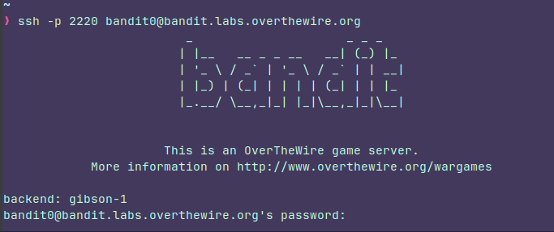
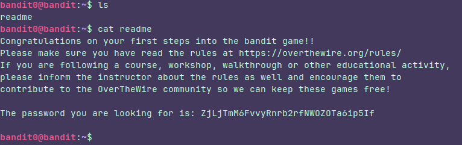

## Level 0
### Instructions: 
The goal of this level is for you to log into the game using SSH. The host to which you need to connect is **bandit.labs.overthewire.org**, on port 2220. The username is **bandit0** and the password is **bandit0**. Once logged in, go to the [Level 1](https://overthewire.org/wargames/bandit/bandit1.html) page to find out how to beat Level 1.

The password for the next level is stored in a file called **readme** located in the home directory. Use this password to log into bandit1 using SSH. Whenever you find a password for a level, use SSH (on port 2220) to log into that level and continue the game.

### Thought process:

First of all we need to know what's **SSH**. SSH means **Secure Shell**, It is a safe way to connect to another computer over the internet, in this case we are connecting to a server to control it from our PC.

They're giving us an username, password, domain name and port. The second step is to know how we can use this stuff.

Imagine a building full of apartments, the **IP  or domain** would be the building address and the **port** would be the number of a specific apartament. By default If you wanna connect to a server and you don't specify the port It will use the default port which is 22, but here they are giving us a specific port so that's what we'll gonna use.

So we have to type some like this:
**ssh -p port number username@domain**

Since they gave us all the neccesary stuff, we're all set.

We are almost done, we just have to know where's the readme, read it and save the Pw.

