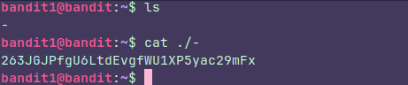
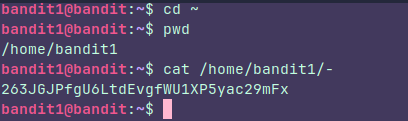

## Level 1

### Instructions:

The password for the next level is stored in a file called **" - "** located in the home directory

### Thought process:

First of all we have to connect again to the server ussing ssh, the user is now bandit1 and the password is the one we found in the level 0.

We have to use **ls** to find the file, but here is the tricky part:

The file name is **" - "** and this is special because if we use **cat -** the shell is going to be expecting you to type a command like **cat -A , cat -b or whatever**, so we are gonna get stucked here till we type one or till we exit using **CTRL +C**

So, how do we open this? Well, we could type **cat ./-** to avoid the **stdin** problem

The **" . "** is to say, hey Linux, start searching from where we are and the **" / "** is to force Linux to realize that whatever it is after the **"/ "** must be a file or a directory.

It's a quick way to do it, but you could've typed the absolute path too, like this:

The point is to force linux to treat the **" - "** file as what it is... a file.