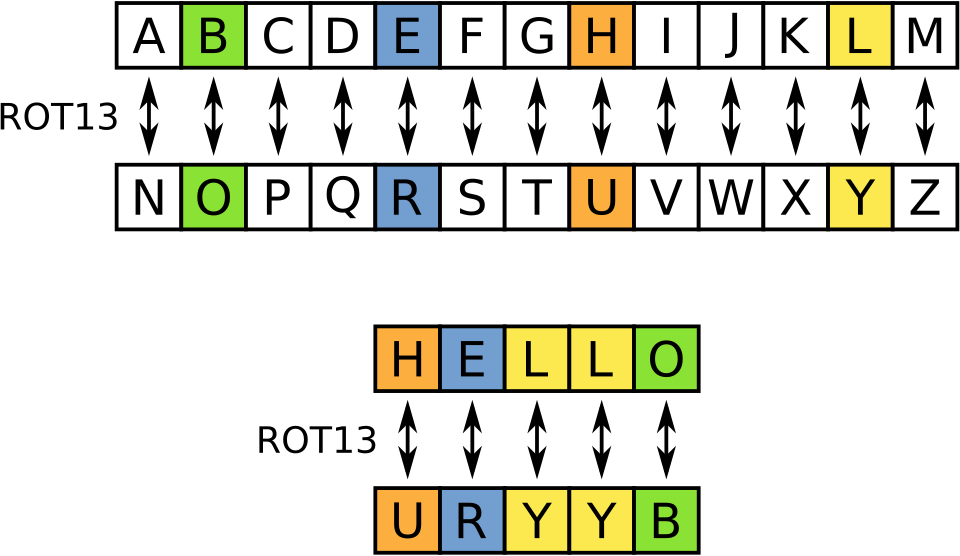
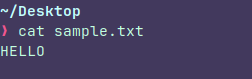
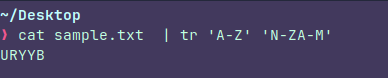
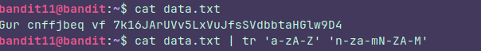

### Instructions:

The password for the next level is stored in the file **data.txt**, where all lowercase (a-z) and uppercase (A-Z) letters have been rotated by 13 positions
### Thought process:

"Rotate 13 positions" stands for ROT13 which is a modification of the Caeser cipher,
it replaces a letter with the 13th letter after it in the Latin alphabet, like this:

But this is a special case, because If you rotate the word once you will encrypt it but if you do it twice you will decrypt it. This is called **reciprocal cipher**

**" tr "** Is pefect for this, but It has to be used in a kinda odd way.

### Basics about tr

**tr** allows us replace stuff with other stuff. Let's say you want to replace all  uppercase letters with lowercase letters:

You could type this: **tr A-Z a-z** It's creating two list but in a quick way, **A-Z** means all the uppercase letters of the latin alphabet and **a-z** means all the lowercase letters of the latin alphabet.

So A will be a, B will be b and so on...

Now that we know the basics let's try to do the  **rot13** with the word **HELLO**

The example tell us that he **" H "** must turn into **" U "**, **" E "** into **" R "** and so on, so...
If we are in **" H "** we have to advance 13 places to get to **" U "** with that in mind we can work.

### Let's break this down

The command `tr 'A-Z' 'N-ZA-M'` works by mapping two lists of characters. Since the goal is to rotate the alphabet by 13 positions, we need to align our "Source" list with our "Destination" list.

**1. The Source List (`'A-Z'`)** This is straightforward. The command creates a full list of all uppercase letters from A to Z: `ABCDEFGHIJKLMNOPQRSTUVWXYZ`

**2. The Destination List (`'N-ZA-M'`)** This is where the ROT13 logic happens. We need to tell the computer what each letter from the first list should become.

- **Part 1: `N-Z`** In ROT13, **A** becomes **N**, **B** becomes **O**, and so on. By starting our second list with `N-Z`, we are mapping the first 13 letters (**A through M**) to the letters **N through Z**.
    
- **Part 2: `A-M`** Now we have a problem: we still need to decide what to do when the command encounters the letter **N** in the first list. Since we've already used up the alphabet until Z, we "wrap around" and start from the beginning. By adding `A-M` at the end, the letter **N** from the first list maps to **A**, **O** maps to **B**, and so on.

### The Final Mapping

When you put them together, `tr` aligns the characters like this:

| **Source (A-Z)**         | **A B C D E F G H I J K L M** | **N O P Q R S T U V W X Y Z** |
| ------------------------ | ----------------------------- | ----------------------------- |
| **Destination (N-ZA-M)** | `N O P Q R S T U V W X Y Z`   | `A B C D E F G H I J K L M`   |

The file bandit gave us is kinda harder because it has both upper and lower letters but it's pretty much the same just a litte longer, it's the same logic. 

