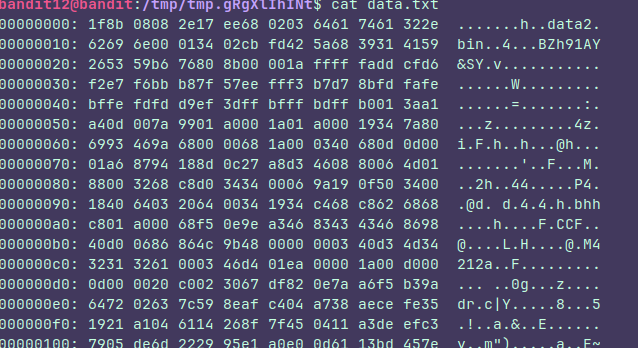
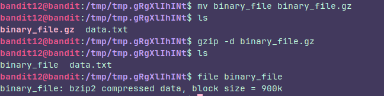
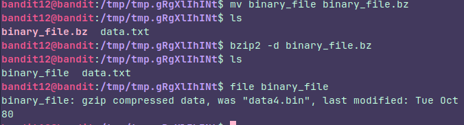
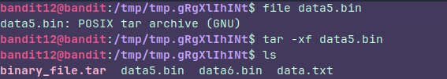

## Level 12

### Instructions:
The password for the next level is stored in the file **data.txt**, which is a hexdump of a file that has been repeatedly compressed. For this level it may be useful to create a directory under /tmp in which you can work. Use mkdir with a hard to guess directory name. Or better, use the command “mktemp -d”. Then copy the datafile using cp, and rename it using mv (read the manpages!)

### Thought process:

I wanted to see how  hex looks like:

This hex could be anything so i needed to turn it into a binary file to see what it was.

A gzip compressed file, so I had to decompress it

I also had to change its name to follow the **gzip protocol**  and Voilà, yet another compressed file, guess what I did, exactly, the same thing but using **bzip** instead

and so on...

To decompress tar files it's slightly different, you don't have to rename the file and you have to delete the compressed file manually.

So after an eternity decompressing, you'll finally get the password