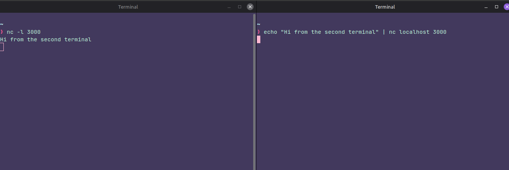

### Instructions:

The password for the next level can be retrieved by submitting the password of the current level to **port 30000 on localhost**.

### Thought process:

This is how yo can log in using the ssh key:

We can use **nc** to send the password, but what's that?

### nc in short
**nc**  is a tool to send and receive raw data over the network

The first terminal is listening on  port 3000 and the second one is  sending some raw data.

With that in mind, now we  can get the password and send it to localhost:

