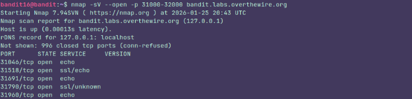
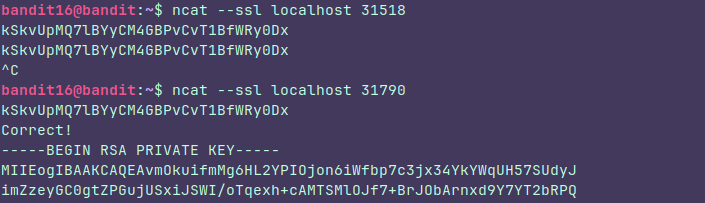

## Level 16

### Instructions:

The credentials for the next level can be retrieved by submitting the password of the current level to **a port on localhost in the range 31000 to 32000**. First find out which of these ports have a server listening on them. Then find out which of those speak SSL/TLS and which don’t. There is only 1 server that will give the next credentials, the others will simply send back to you whatever you send to it.

### Thought process:
 I think the easiest way to do this is using **namp** because it has useful options like **--open** and **-sV**

 

### Let's break this down

I used **-sV** because it's the option which let us know what service is running on a port.
I used **--open** because I only needed the open ports
I used **-p** to search for open ports within the given range.

It was kinda slow because de **sV** tries a lot of stuff trying to guess the service that is running.

So, I sent the password to the **31518 and 31798** ports because they were the only ones with ssl service and the **31798** gave me the key

