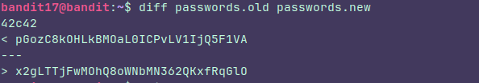

## Level 17
### Instructions:
There are 2 files in the homedirectory: **passwords.old and passwords.new**. The password for the next level is in **passwords.new** and is the only line that has been changed between **passwords.old and passwords.new**

**NOTE: if you have solved this level and see ‘Byebye!’ when trying to log into bandit18, this is related to the next level, bandit19**

### Thought process:

This problem is made for **diff**  which is a command that let us know what do we have to change to make one file identical to another file.

**42c42** tell us that we have to replace line 42 of the old file with line 42 of the new file and it also shows  the difference.