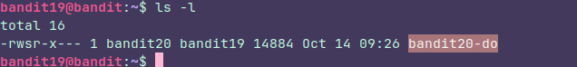
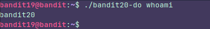
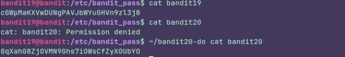

## Level 19

### Instructions

To gain access to the next level, you should use the setuid binary in the homedirectory. Execute it without arguments to find out how to use it. The password for this level can be found in the usual place (/etc/bandit_pass), after you have used the setuid binary.

### Thought process:

This was pretty easy because I had already covered this on **Linux journey** 

I started by checking the permissions:

The owner has all permissions as expected but the file also has **"s"** bit  which means de **suid** is activated.

It's like a mask, it allow us to execute the file as  if we were bandit20, like this:

It's worth noting that we can do this because **bandit19** has **execute** permission. Then, when we run the binary, the system automatically  **"dresses us up"**  as bandit20 because of the **s** 

This only worked because I had the **bandit20 mask**

