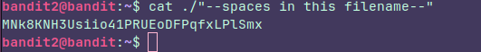

### Instructions:

The password for the next level is stored in a file called `--spaces in this filename--` located in the home directory

### Thought process:

It's tricky everywhere, the file name has this: **" - "** again, but it's ok, we already know how to deal with it, but... the file name has also spaces and spaces function as a separator between options and arguments.

### For example:

If we type: **cat file with spaces.txt** cat is gonna try to read a file called **file,** a file called **with** and a file called **spaces.txt**  why does this happen? it's all because the spaces. To cat in this case each text after an space is taken as an argument, a file to search, read and display its contents, so it's thinking "ok, they user wants me to display the content of 3 files at the same time" and this happens with a lot of commands so, the way to avoid this (one way) is by typing the file name bettween **""**  like this:

It's worth noting that we have to use **" ./ "** because we don't want  cat to think that the **" -- "** at the beginning of the file name are options (as we learned in the previous level).