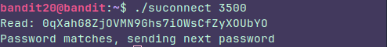

## Level 20

### Instructions:

There is a setuid binary in the homedirectory that does the following: it makes a connection to localhost on the port you specify as a commandline argument. It then reads a line of text from the connection and compares it to the password in the previous level (bandit20). If the password is correct, it will transmit the password for the next level (bandit21).

**NOTE:** Try connecting to your own network daemon to see if it works as you think

### Thought process:

This was kinda harder, not because what I had to do but because the instructions. At first I was trying to send the password using the binary but I had to do it using the **nc**. 

This level was more like: I know what I have to do, because I've done this before, but i don't know the exact way the game wants me to do it. So it was like **Try and fail** level

