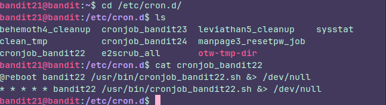
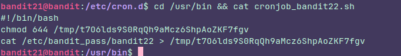
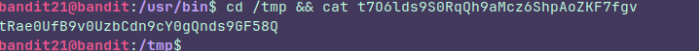

## Level 21

### Instructions:

A program is running automatically at regular intervals from **cron**, the time-based job scheduler. Look in **/etc/cron.d/** for the configuration and see what command is being executed.

### Thought process:

You can think of **cron** as the **"alarm clock"** of Linux. It is a daemon that runs continuously and executes commands or scripts at specific intervals.

#### How does it work?

The system uses configuration files called **crontabs** . Each line in a crontab follows a specific syntax made of five fields  followed by the command to be executed.

* *   *   *   *   *    command

 1st asterisk: Minute (0 - 59) 2nd asterisk: Hour (0 - 23) 3rd asterisk: Day of the month (1 - 31) 4th asterisk: Month (1 - 12) 5th asterisk: Day of the week (0 - 6, where 0 is Sunday)

With that in mind we can go on.

I went to the path the instruction told me to go, kinda guess which file should I check and then this came out:

That means, every **minute** and every **reboot** is gonna execute something called **cronjob_bandit22.sh**.   The output goes to the black hole.

So I looked over the script:

The script is just sending the password to another file, so i just had to check that file

