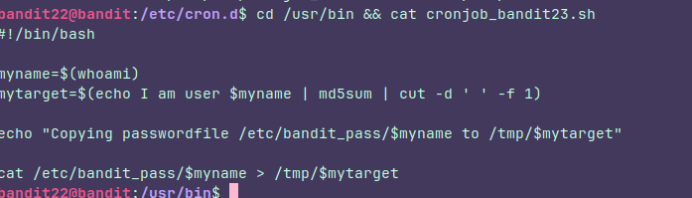
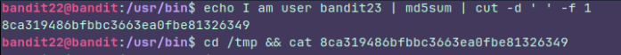

## Level 22

### Instructions:

A program is running automatically at regular intervals from **cron**, the time-based job scheduler. Look in **/etc/cron.d/** for the configuration and see what command is being executed.

**NOTE:** Looking at shell scripts written by other people is a very useful skill. The script for this level is intentionally made easy to read. If you are having problems understanding what it does, try executing it to see the debug information it prints.

### Thought process:

This is pretty much the same as level 21. The only difference is  that the script is different.

It's just hashing **I am user bandit23** using **md5sum** which makes sure every unique input produces a different hash. It is mainly used to verify that a file hasn't been corrupted or altered.

So i just had to go to `/tmp/` and open the **the file with the hash name** to get the password

It's important to change **$myname** to **bandit23** otherwise we are gonna get a different hash.