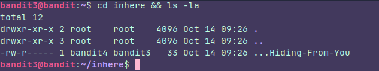
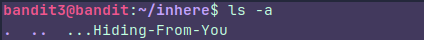
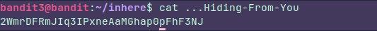

### Instructions:
The password for the next level is stored in a hidden file in the **inhere** directory.

### Thought process:
We have to access  the **" Inhere "** directory and use the **"-a"** command because we are looking for a hidden file.

In this case I used  **"-la"**  to avoid any confusion with the file name, because, If you type just 
**" ls -a "** you could think that the file name is **".  ..  ...Hiding-from-you"** and that would be wrong.

Now we can easily get the password

