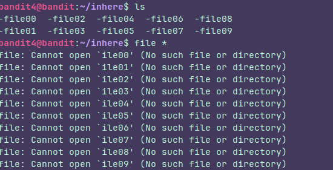

## Level 4

### Instructions:
The password for the next level is stored in the only human-readable file in the **inhere** directory. Tip: if your terminal is messed up, try the “reset” command.

### Thought process:

There are many files in the directory so, instead of reading their contents one by one, we could use the command **" file "**  but...

Bash is taking the first **" -f "** of the name as an option, so we have to change that, like this:

Now It's pretty clear which one we should choose.