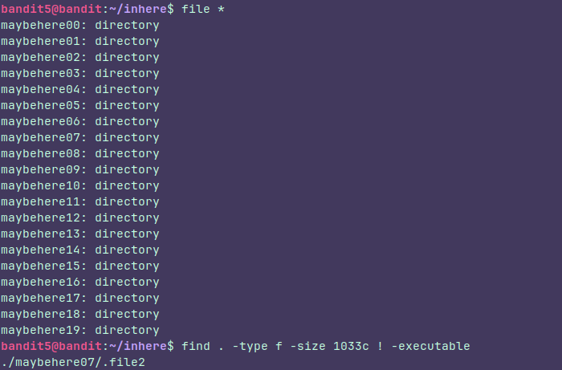

## Level 5

### Instructions:
The password for the next level is stored in a file somewhere under the **inhere** directory and has all of the following properties:

- human-readable
- 1033 bytes in size
- not executable

### Thought process:

There are a lot of directories and files again and we don't want to check them one by one so, we could use the tips they gaves us like this:

### Let's break this down:

First or all I used **" file*"** to find out whether what was there were files or directories It wasn't rlly that neccesary but it's ok.

Next I used the tips they gave us in the find command like this:
**-find .**  to search in the current directory
**-type f** because we are looking for files not directories.
**-size 1033c** because we are looking for an specific size. It's worth noting that the given size  is in bytes, that's why we are adding the **"c"** at the end.
**c = bytes
k = kilobytes
M = megabytes
G = Gigabytes**

**! -executable** because the file is no executable, **" ! "** means not.