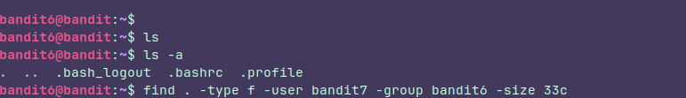
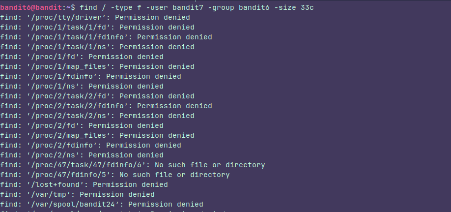
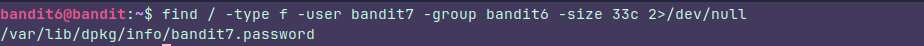

### Instructions:

The password for the next level is stored **somewhere on the server** and has all of the following properties:

- owned by user bandit7
- owned by group bandit6
- 33 bytes in size

### Thought process:

It's kinda tricky, this is the first thing I tried:

And nothing happend. **-user bandit7** to indicate the user of the owner and **-group bandit6** to indicate the owner group and nothing happened. So, the file wasn't there.

But then I realized I was looking for the file using my current path, but the file should be somewhere, right? so I tried the same starting from the root.

And this is what I got:

A bunch of permission denied.

So in order to filter, I got rid of those messages like this and Voalà:

### What's 2>/dev/null ?

2 represents **stderr.** These are all  error messages, in this case, all the permission denied messages, so we're sending those messages to **/dev/null** which is a special file designed to dispose of all you send to it

