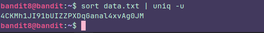

## Level 8

### Instructions:

The password for the next level is stored in the file **data.txt** and is the only line of text that occurs only once

### Thought process:

The command **uniq -u** is perfect for this. But we have to keep in mind that isn't gonna work if we don't sort the text in the file first, example:
Imagine this is the stdout from **cat data.txt**
**book
paper
book
paper
apple**

If we use **unique -u** in the file, isn't gonna work as we expected. It's gonna return to us the full text because it compares line one by one. If the word in the first line isn't the same as the word in the second line, the command is gonna think they are uniques. So we have to sort them and the output would be like this:
**apple
book
book
paper
paper**

apple is equal to book? No. book is equal to book? Yes. book is equal to paper? No. paper  is equal to paper? Yes.  
We are using the **-u** option, so we are asking for the non-repeated word

